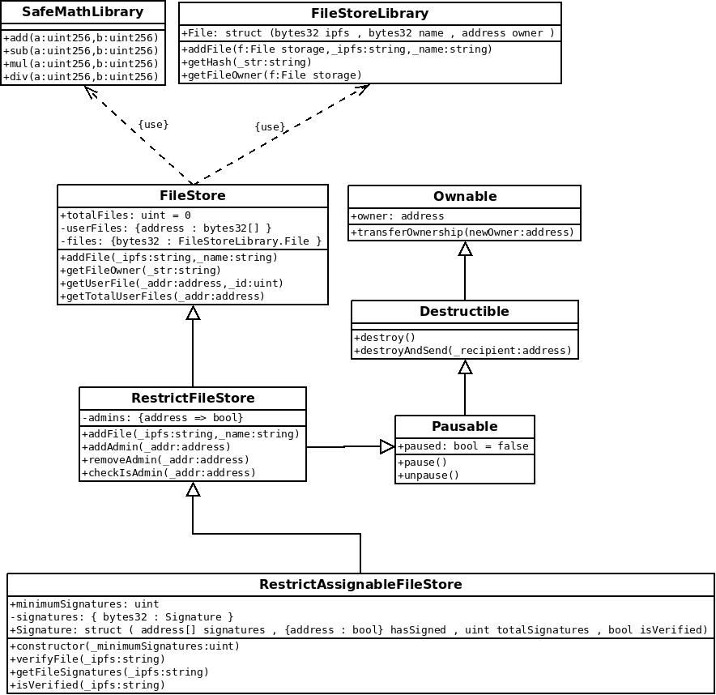

## Design pattern desicions

The smart contracts which were developed and used in the dapp have the purpose of storing ipfs hashes from files added in the IPFS and refer them to a wallet.
The hashes are stored into a struct called "File" that has 3 atributes: a bytes32 called "hash"; bytes32 "name"; and an address "owner". This struct is mapped by a bytes32 variable derived from applying a hash function (keccak256) in the ipfs hash of the file added in the IPFS. When someone uploads a content to ipfs, he can prove the ownership of that content by adding the ipfs hash of the file to the contract and an event will be emited on every ipfs hash added in order to keep track of all user's activities. To verify ownership, other users can get the ipfs hash of a given file and use a contract method to return the wallet that has added this hash.

To develop the dapp two contracts were made. One is a trully decentralized filestore contract that has no owner and the other is a restrict filestore contract that has an owner and can have others admins that can call contract's methods.

To be able to reuse code, the first contract is kept in simpliest form as possible and others contracts, like the restrict filestore, can inherit the filestore contracts methods.

### FileStoreLib 

In order to avoid rewriting the same code a FileStoreLib was created to manipulate File Structs. This library can be used by others contracts as well and it should reduce the gas costs of contracts methods.

### FileStore Contract

In order to avoid calling methods that cannot be called, all methods that require some condition will fail with that condition is not done. The main method of this contract adds an ipfs hash and links it to the wallet who called it. In this case, before running any code the contract verifies if the hash has no owner. 

This contract also stores the total files added in it and it uses SafeMath library for mathematical operations to avoid integer overflow and underflow.

As this contract does not hold or uses ether, no other design pattern was included, but contracts that inherit from that one can.

### Restrict FileStore Contract

This contract inherits the FileStore Contract but has the purpose of being more restrict. To do that, this contract has an owner that is the contract creator, and he can call methods to add admins and remove them. This contract inherits Ownable, Mortal, FileStore and Pausable (Circuit Breaker) contracts so the owner can stop the contract for a while if he wants to pause it or even to destroy it. To add an ipfs hash to this contract the sender of the message should be an admin of the contract or the owner itself.

### Restrict Assignable FileStore Contract

This contract inherits the RestrictFileStore Contract and has the purpose of permiting some kind of verification of files added by some admin. In this case the contract owner define a minimum number of "verfications" and admins can "verify" any file that they are not owner. The "verification" of an file should act as an prove that some admin has reviwed some file and aprove it. This is an example of reusing same codes used by the dApp.

## Architeture of project

### UML Classes OO

