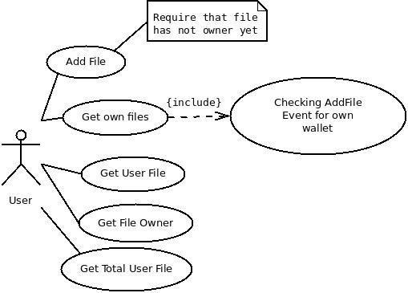
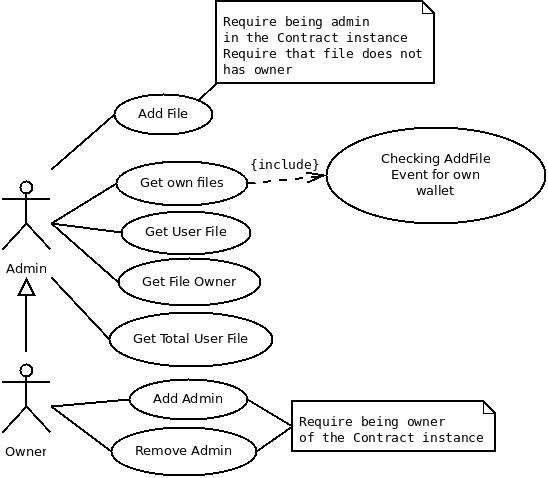
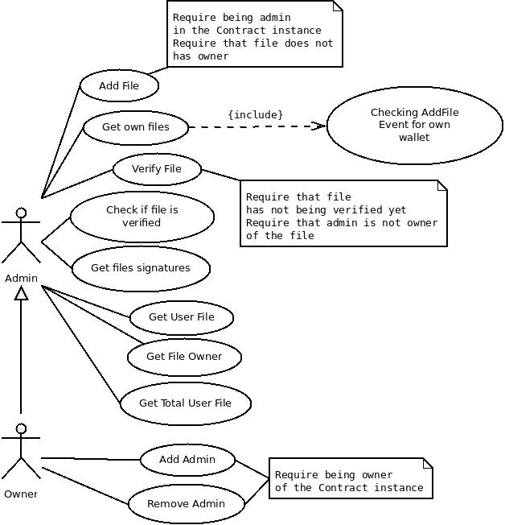

## Decentralized FileStore

The aim of this project is to create a decentralized application that allows users to store files in [IPFS](https://ipfs.io) and refer the hash of that file to its own ethereum wallet. The Dapp will use IPFS to store files and Smart Contracts in Ethereum to refer ipfs hashes to a wallet that has submitted that hash.

One file hash can not be inserted inside the Smart Contract if it already has an owner. Other users can get the wallet address that is owner of some ipfs hash and the Contract should be the  simplest in order to develop others Smarts Contracts by inheriting methods and attributes.

In order to keep track of all hashes inserted in the Smart Contracts, events will be emitted and used by the Dapp to show all user's activities when he uses his Ethereum wallet with Metamask and start the application. As the main objective of this project is to create a truly Decentralize FileStore, the application itself will be in IPFS and the hash of that application will be referred to an Ethereum wallet that uses another Smart Contract more restrict and inherit's from the unrestricted access Smart Contract.

The dapp will use 2 smart contracts to illustrate the functionalities of the main idea, one is named "FileStore" and other "RestrictFileStore". In order to illustrate another possibility, an alternative smart contract is presented too but not used in the dapp itself and it is named "RestrictAssignableFileStore" wich main difference is the option to administrators verify some file that they do not own.

This kind of application has innumerous uses. The simplest of them links an IPFS hash (or googledrive file id or any string ) to a wallet in order to make possible for the user to track all his own activities and prove ownership of those files by proving that he is the owner of the ethereum wallet using signatures. Other possibility can be a restrict filestorage that is more centralized because it has an owner and administrators, added by the owner, who can refer IPFS hashes (or other strings) to their own wallet. This option can be used for a restrict group of people that works together and have a "central authority" that owns the contract.

Others smart contracts can be made by inheriting methods and attributes of the contracts presented in this project. The "RestrictAssignableFileStore" is an example that could be used by a group of people that work together and can "verify" that some content of a file that is owned by others administrators is ok and passed through a member's review. This smart contract will not be used in the Dapp itself but is an example of other contracts that can be made the future.


## Cases of Use

Functionalities of the contracts can be illustrated in a UML Case of Use Diagram.

### FileStore



### RestrictFileStore



### RestrictAssignableFileStore



### Getting Started

The dapp was made using the [pet shop tutorial](https://truffleframework.com/tutorials/pet-shop) presented in the course and modified as required.

**Tested on Ubuntu 16.04**

#### Pre requisites

To run the dapp in localhost you will need to install the following packages:

* NodeJs and NPM

```
$ sudo apt update
$ sudo apt install nodejs npm
```

* Ganache-cli

```
$ sudo npm install -g ganache-cli
```

* Truffle

```
$ sudo npm install -g truffle
```

* Metamask browser extension

Instructions at [https://metamask.io](https://metamask.io)

* IPFS (not required for testing)

```
$ wget https://dist.ipfs.io/go-ipfs/v0.4.18/go-ipfs_v0.4.18_linux-amd64.tar.gz
$ tar xvfz go-ipfs.tar.gz
$ cd go-ipfs
$ ./install.sh
```

### Running Dapp example

Install git if not installed and clone this repository

```
# if git is not installed run first
# $ sudo apt-get install git-core
$ git clone https://github.com/henrique1837/ConsensysDevProgram2018
# Move to the directory and open another terminal after
$ cd ConsensysDevProgram2018
```

Start a ganache private blockchain in another terminal

```
# Second terminal
$ ganache-cli
```

Compile and migrate Smart Contracts using the first terminal

```
# First terminal
$ truffle compile
$ truffle migrate
```

Test contracts

```
$ truffle test
```

Run development server

```
$ npm run dev
```

Use the seed or some private key generated by ganache to interact with the dapp using metamask connected to localhost:8545

### Testing dapp on public test Ethereum network


The dapp is located at [https://cloudflare-ipfs.com/ipfs/QmWhwruVYNTfvXMxnp4VwF5WUZwdVZ199LEbsQgawAzP2E](https://cloudflare-ipfs.com/ipfs/QmWhwruVYNTfvXMxnp4VwF5WUZwdVZ199LEbsQgawAzP2E) and [https://izzipage.com/sites/project](https://izzipage.com/sites/project) in case of first link do not load.
The unrestricted Smart Contract used in the Dapp is located in the Ropsten Ethereum network at the address [0x1dbabeb4728695be99e5efeff435bddd1897f9cf](https://ropsten.etherscan.io/address/0x1dbabeb4728695be99e5efeff435bddd1897f9cf) and  the restricted Smart Contract that refers this Dapp is located at the address [0xad50bfbd51b16c6a751da4d54fd6d849c7af27a0](https://ropsten.etherscan.io/address/0xad50bfbd51b16c6a751da4d54fd6d849c7af27a0).

 In the application users should be able to use "Decentralized FileStore" to refer some ipfs hash to its own wallet by uploading contents directly from the dapp to IPFS or by including hashes of files added by themselves inside the contract. The "Restrict FileStore" Contract should be created by the user and he will have to add, or not, admins that will be able to refer ipfs hashes to their own wallets. The "RestrictAssignableFileStore" can be deployed and tested using [MyEtherWallet](https://www.myetherwallet.com/) or [Remix](https://remix.ethereum.org/).
